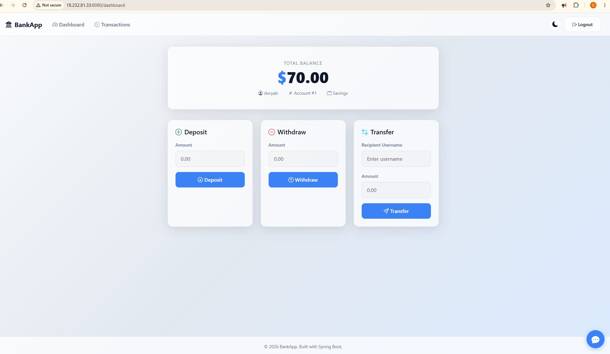

# AI Bank App — DevSecOps

A Spring Boot banking web application built with **Java 21**, **MySQL**, **Thymeleaf**, **Spring Security**, and **Ollama**, with a complete GitHub Actions **DevSecOps CI/CD pipeline**.




## Architecture

The application runs as a containerized Spring Boot service and communicates with MySQL for persistence and Ollama for AI functionality.

```text
                    GitHub Repository
                           │
                           ▼
                 GitHub Actions Pipeline
                           │
        ┌──────────────────┼──────────────────┐
        │                  │                  │
   Code Quality       Security Scans     Docker Security
        │                  │                  │
        └──────────────────┼──────────────────┘
                           ▼
                    Docker Build
                           │
                           ▼
                       Docker Hub
                           │
                           ▼
                    Trivy Image Scan
                           │
                           ▼
                    EC2 / Production
                           │
              ┌────────────┼────────────┐
              ▼            ▼            ▼
          Bank App       MySQL        Ollama
          :8080          :3306        :11434
```

### Main components

* **Spring Boot 3.5** application using Java 21.
* **Spring Data JPA / Hibernate** for database access.
* **MySQL 8.0** for persistent application data.
* **Spring Security** for application security.
* **Thymeleaf** for the web UI.
* **Ollama / TinyLlama** for AI functionality.
* **Docker & Docker Compose** for containerization and local/production orchestration.
* **Spring Actuator** exposes the health endpoint.
* **Prometheus/Micrometer** support is included in the application dependencies.

The application listens on **port `8080`**.

## Run Locally

### Prerequisites

* Java 21
* Maven 3.9+
* Docker & Docker Compose

### Option 1 — Run with Maven

Clone the repository:

```bash
git clone https://github.com/Duryab333/AI-BankApp-DevOps.git
cd AI-BankApp-DevOps
```

Start the application:

```bash
./mvnw spring-boot:run
```

The application will be available at:

```text
http://localhost:8080
```

The application uses environment variables for MySQL and Ollama configuration, with local defaults defined in `application.properties`.

### Option 2 — Run the complete stack with Docker Compose

```bash
docker compose up -d
```

The Compose stack starts:

| Service  |                      Port |
| -------- | ------------------------: |
| Bank App |                    `8080` |
| MySQL    | `3307` → container `3306` |
| Ollama   |                   `11434` |

The application connects to MySQL and Ollama through the internal Docker network. MySQL and Ollama data are persisted using Docker volumes.

To stop the stack:

```bash
docker compose down
```

## DevSecOps Pipeline

The pipeline is to be triggered  manually. It is implemented as a main workflow that calls separate reusable workflows for each security and delivery stage.

```text
Push to main
     │
     ▼
┌─────────────────────┐
│   Code Quality      │
│ Maven + Tests       │
│ SpotBugs + Sonar    │
└──────────┬──────────┘
           │
           ├──────────────► Gitleaks Secret Scan
           │
           └──────────────► OWASP Dependency Check
                                  │
                                  ▼
                         Dockerfile Scan
                            Hadolint
                                  │
                                  ▼
                         Docker Build & Push
                              Docker Hub
                                  │
                                  ▼
                          Trivy Image Scan
                         CRITICAL = failure
                                  │
                                  ▼
                           EC2 Deployment
```

### 1. Code Quality & Testing

The pipeline:

* Validates **Java 21** and **Maven 3.9+** using Maven Enforcer.
* Runs `mvn clean verify`.
* Executes the project's tests.
* Runs **SpotBugs** for static analysis.
* Runs **SonarCloud** analysis.
* Waits for the SonarCloud quality gate before continuing.

A MySQL service is also started during the quality workflow so tests can run against a database environment.

### 2. Secret Scanning

**Gitleaks** scans the repository for accidentally committed secrets and credentials.

### 3. Dependency Security

**OWASP Dependency-Check** analyzes project dependencies against known vulnerabilities.

The pipeline is configured to fail when vulnerabilities reach **CVSS 7 or higher**.

### 4. Dockerfile Security

Before building the image, **Hadolint** validates the Dockerfile for Dockerfile best-practice and security issues.

The Docker image uses:

```dockerfile
FROM eclipse-temurin:21-jdk-jammy
```

It builds the application with the Maven wrapper, exposes port `8080`, and starts the generated Spring Boot JAR.

### 5. Image Build & Push

After all previous gates pass, the application is packaged into a Docker image and pushed to **Docker Hub**.

Images are tagged with:

* `latest`
* Git branch name
* Git commit SHA

The commit SHA provides an immutable image reference for deployment.

### 6. Container Image Scanning

**Trivy** scans the pushed Docker image for vulnerabilities.

The pipeline is configured to fail when **CRITICAL vulnerabilities** are detected.

### 7. Deployment

Only after the image scan succeeds does deployment run.

The deployment workflow:

1. Connects to the production EC2 server through SSH.
2. Copies the Docker Compose file to the server.
3. Logs into Docker Hub.
4. Pulls the required image.
5. Recreates the Docker Compose stack.

This provides a gated flow where code and container security checks complete before deployment.

## Security Gates

| Stage               | Tool                   | Purpose                          |
| ------------------- | ---------------------- | -------------------------------- |
| Code validation     | Maven Enforcer         | Java/Maven version enforcement   |
| Static analysis     | SpotBugs               | Detect Java code defects         |
| Code quality        | SonarCloud             | Code analysis & quality gate     |
| Secret scanning     | Gitleaks               | Detect committed secrets         |
| Dependency scanning | OWASP Dependency-Check | Detect vulnerable dependencies   |
| Dockerfile scanning | Hadolint               | Dockerfile best practices        |
| Image scanning      | Trivy                  | Detect container vulnerabilities |
| Deployment          | GitHub Actions + SSH   | Automated production deployment  |

## Repository Structure

```text
.
├── .github/
│   └── workflows/
│       ├── DevSecOps-pipline.yml
│       ├── code_quality.yml
│       ├── secrete_scan.yml
│       ├── dependency_check.yml
│       ├── docker_scan.yml
│       ├── build_and_push.yml
│       ├── image_scan.yml
│       ├── deploy_to_server.yml
│       └── owasp-update.yml
├── src/
├── Dockerfile
├── docker-compose.yml
├── pom.xml
└── dependency-check-suppressions.xml
```

## Required GitHub Configuration

The CI/CD workflows use GitHub Actions **secrets and variables** for external services and deployment credentials, including Docker Hub, SonarCloud, NVD, and EC2 access.

These credentials should be configured in the repository's **Settings → Secrets and variables → Actions** rather than committed to source control.
